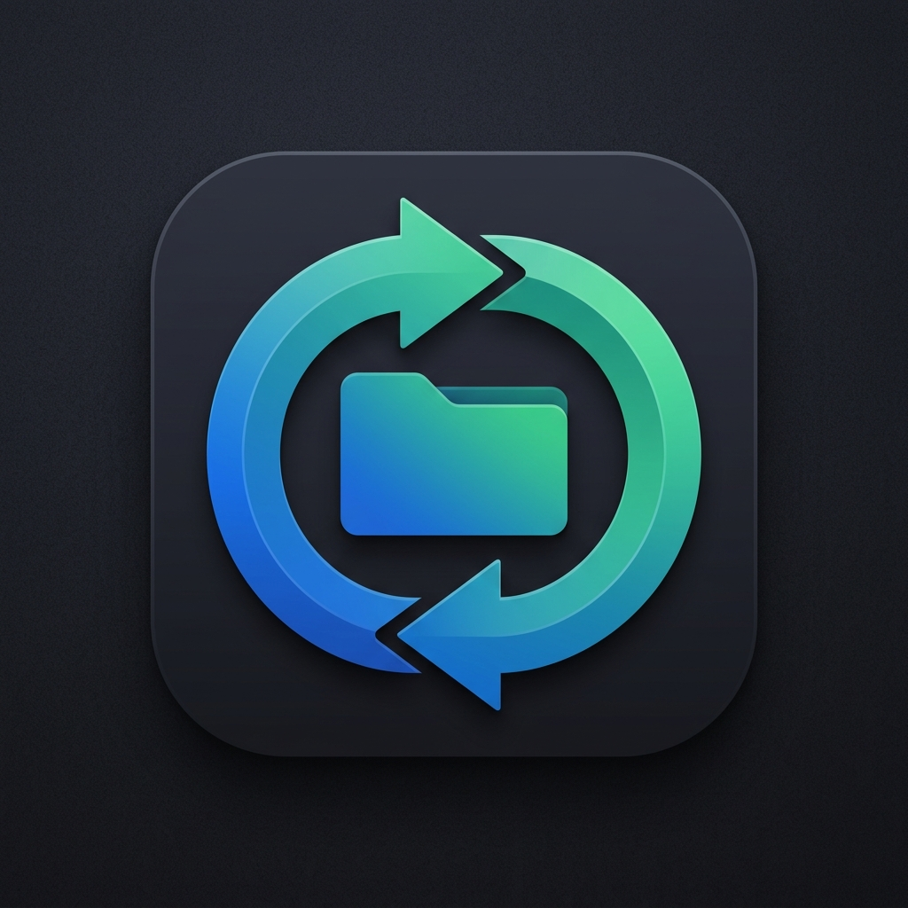

# WoodStreamFileSync

<div align="center">
  
  <h3>Windows向け バックグラウンドフォルダ同期ツール (Robocopy + NAS認証 + リアルタイム変更検知)</h3>

  [](https://dotnet.microsoft.com/)
  [](https://www.microsoft.com/windows)
  [](https://github.com/tkizawa/WoodStreamFileSync)
  [](https://github.com/tkizawa/WoodStreamFileSync)
  [](LICENSE)
</div>

---

## 📖 概要 (Overview)
**WoodStreamFileSync** は、Windows上でタスクトレイに常駐し、指定したローカルフォルダまたはネットワークフォルダ（NAS・ファイルサーバー）間を高信頼な Windows 標準コマンド `robocopy.exe` を用いてバックグラウンド自動同期するデスクトップアプリケーションです。

---

## 🌟 主な特長 (Features)

- **🚀 タスクトレイ常駐 & 軽量設計**:
  - 普段はタスクトレイ（通知領域）に格納され、システムリソースをほとんど消費しません。
  - トレイアイコンのダブルクリックで設定画面をいつでも素早く開くことができます。
  - ウィンドウの `[X]` 閉じるボタンを押しても終了せず、トレイ常駐を維持します。
- **📁 複数フォルダペアの同期設定 & 個別管理**:
  - 複数の同期元・同期先フォルダペアを登録可能。各ペアごとに同期の有効/無効、個別手動同期、削除を柔軟に操作できます。
- **⏱️ ハイブリッド同期トリガー**:
  - **定期タイマー同期**: 5分、10分、15分、30分、60分、120分など指定インターバルで登録中の全フォルダを定期同期。
  - **リアルタイム変更検知**: 複数の同期元フォルダを `FileSystemWatcher` で同時監視。ファイル変更のあったフォルダペアのみをピンポイントで同期可能。
  - **デバウンス制御**: 連続ファイル書き込みや大量ファイルコピー中に多重起動しないよう、更新が落ち着いてから1回だけ安全に同期を実行。
- **🔐 NAS / ネットワーク事前認証 (UNCパス対応)**:
  - `\\server\share` などの UNC パスへのアクセス時、同期直前に Windows API (`mpr.dll` の `WNetAddConnection2`) を呼び出して自動的にセッションを確立。
  - パスワードは **Windows DPAPI (`ProtectedData`)** により暗号化されて安全に保管。
  - UIからワンクリックで接続検証できる「**接続テスト**」機能を搭載。
- **🌓 Windows ダークモード & ライトモード両対応**:
  - Windows OS のテーマ設定に自動連動。DWM API によるダークタイトルバーにも対応。
  - 設定画面から「Windowsに追従」「ライトモード」「ダークモード」を手動で即座に切り替え可能。
- **🌐 日本語 & 英語 完全対応 (Multilingual)**:
  - Windows OS の表示言語を自動検知して日本語/英語で表示。
  - 設定画面から「Windowsに追従」「日本語 (Japanese)」「English (英語)」をいつでも即座に切り替え可能。
- **📊 リアルタイムログビューア & 操作説明ガイド**:
  - 実行履歴、ファイル転送状況、エラー詳細をカラーバッジ付きでリアルタイム表示（ログコピー・クリア・フォルダオープン機能付き）。
  - アプリ内に初心者の方向けの丁寧な「**❓ 操作説明**」ウィンドウを内蔵。
- **🛡️ 堅牢な排他制御 & エラーハンドリング**:
  - `SemaphoreSlim` により手動・定期・リアルタイム検知が重複実行されない安全設計。
  - Robocopy 特有の終了コード（0〜7: 成功 / 8以上: エラー）を正確に判定し、エラー時はデスクトップ通知を発行。

---

## 🛠️ 動作環境
- **OS**: Windows 10 (version 1809 以降) / Windows 11
- **ランタイム**: .NET 10.0 Windows Desktop Runtime

---

## 🏗️ プロジェクト構造
```
WoodStreamFileSync/
├── WoodStreamFileSync.csproj       # プロジェクト定義 (.NET 10, WPF, H.NotifyIcon)
├── App.xaml / App.xaml.cs          # アプリケーションエントリ、トレイ常駐、Mutex単一インスタンス
├── Models/
│   ├── AppConfig.cs                # 設定データモデル (Robocopyオプション含む)
│   ├── SyncFolderPair.cs           # 同期フォルダペアモデル (Id, Name, Source, Dest, IsEnabled)
│   ├── AppTheme.cs                 # テーマ列挙型 (System, Light, Dark)
│   ├── AppLanguage.cs              # 言語列挙型 (System, Japanese, English)
│   ├── SyncLogEntry.cs             # ログモデル (LogLevel, Timestamp, Message)
│   └── SyncStatus.cs               # 同期ステータス (Idle, Syncing, Success, Error)
├── Services/
│   ├── ConfigManager.cs            # JSON設定管理 + DPAPI暗号化/復号 + スタートアップ登録 + 移行処理
│   ├── LocalizationService.cs      # 多言語管理サービス (日本語 / 英語)
│   ├── ThemeService.cs             # テーマ管理 & Windowsダークタイトルバー連携
│   ├── NasAuthenticator.cs        # WNetAddConnection2 によるNAS認証 & 接続テスト
│   ├── RobocopyRunner.cs           # Robocopy非同期実行・引数構築・終了コード判定
│   ├── FolderWatcherService.cs     # 複数ディレクトリ FileSystemWatcher + デバウンス制御
│   ├── SyncManager.cs              # 排他制御 SemaphoreSlim、複数フォルダ同期調停、トレイ通知
│   └── LoggerService.cs            # ログイベント配信 + 日別ログファイル出力
├── ViewModels/
│   ├── ViewModelBase.cs            # MVVM基底クラス & RelayCommand / AsyncRelayCommand
│   ├── SettingsViewModel.cs        # 設定画面 ViewModel (複数ペアリスト管理)
│   ├── FolderPairViewModel.cs      # フォルダペア単体 ViewModel
│   └── LogViewModel.cs             # ログ画面 ViewModel
├── Views/
│   ├── Converters.cs               # XAMLバリューコンバーター & PasswordBoxHelper
│   ├── SettingsWindow.xaml / .cs   # モダン設定ウィンドウ
│   ├── LogWindow.xaml / .cs        # リアルタイムログビューア
│   └── HelpWindow.xaml / .cs       # 操作説明ガイドウィンドウ
├── Strings/
│   ├── Strings.ja.xaml             # 日本語リソース辞書
│   └── Strings.en.xaml             # 英語リソース辞書
├── Themes/
│   ├── LightTheme.xaml             # ライトテーマ用パレット
│   └── DarkTheme.xaml              # ダークテーマ用パレット
├── Resources/                      # アイコン画像 (.ico / .png)
└── WoodStreamFileSync.Tests/       # 単体テスト / 結合テスト (xUnit)
```

---

## 🚀 ビルド & 実行手順

### 1. 開発実行
```powershell
# 依存関係の復元とビルド
dotnet build

# アプリケーションの起動
dotnet run
```

### 2. テストの実行
```powershell
dotnet test WoodStreamFileSync.Tests/WoodStreamFileSync.Tests.csproj
```

### 3. リリース用単一 exe (Single File) 発行
.NET ランタイム未インストールの PC でも動作する単一の `.exe` を作成する場合：
```powershell
dotnet publish -c Release -r win-x64 --self-contained true -p:PublishSingleFile=true -p:IncludeNativeLibrariesForSelfExtract=true -o ./publish
```

---

## 📋 操作マニュアル

### 1. タスクトレイ（通知領域）での操作
- **アイコン ダブルクリック**: 「設定」画面を表示します。
- **アイコン 右クリックメニュー**:
  - **⚡ 今すぐ同期**: 即座にフォルダ同期を実行します。
  - **👁️ リアルタイム監視の有効/無効**: ファイル変更検知のオン/オフをワンクリックで切り替えます。
  - **⚙️ 設定...**: 設定画面を表示します。
  - **📋 ログ表示...**: リアルタイム動作ログ画面を表示します。
  - **❓ 操作説明...**: 操作説明ガイド画面を表示します。
  - **🚪 終了**: 常駐を終了してアプリを完全に閉じます。

### 2. 設定画面の各項目
| 項目グループ | 設定項目 | 説明 |
| :--- | :--- | :--- |
| **📁 同期フォルダ** | 同期元 (Source) | バックアップ元のフォルダパス（「参照...」ボタン対応） |
| | 同期先 (Dest) | コピー先のフォルダパス（ローカルパス または UNCパス `\\server\share`） |
| **⏱️ 同期モード** | 定期同期 | 有効にすると、指定間隔（5, 10, 15, 30, 60, 120分）で定期同期 |
| | リアルタイム検知 | 有効にすると、ファイルの作成・更新・削除・名前変更を検知して自動同期 |
| | 変更後待機 (秒) | ファイル連続書き込みが落ち着くまで待機するデバウンス秒数（既定: 10秒） |
| **🔐 NAS認証** | 有効トグル | UNCパス接続時に事前セッション認証を行う場合に有効化 |
| | ユーザー名 / パスワード | NASのログイン資格情報（パスワードは Windows DPAPI で暗号化保存） |
| | 接続テスト | 設定したパスと資格情報で即座に接続できるかをテスト |
| **⚙️ Robocopyオプション** | ミラーリング (`/MIR`) | ソースに存在しないファイルを同期先から自動削除（完全ミラー） |
| | 空サブフォルダ含む (`/E`) | 空のディレクトリも含めて同期 |
| | リトライ回数 (`/R`) / 待機 (`/W`) | ファイルロック時などのリトライ設定（既定: 各1回） |
| | 除外ファイル (`/XF`) / フォルダ (`/XD`) | 同期対象外とするファイルやフォルダ（例: `*.tmp`, `.git` など） |
| | 追加引数 | Robocopy に直接渡す任意のオプション（例: `/FFT /MT:8` など） |
| **💻 外観 & 動作** | 外観テーマ | Windowsに追従 / ライトモード / ダークモード |
| | 表示言語 (Language) | Windowsに追従 / 日本語 (Japanese) / English (英語) |
| | スタートアップ起動 | Windows ログイン時に自動起動して常駐 |
| | 閉じるボタンの動作 | `[X]` ボタン押下時に終了せずタスクトレイに最小化 |

---

## ⚠️ ご利用上の注意事項・免責事項 (Disclaimer)

> [!CAUTION]
> 本ソフトウェアをご利用いただく前に、以下の注意事項および免責事項を必ずご確認ください。

1. **同期エンジンに `Robocopy` を使用しています**:
   - 本ツールは Windows 標準のファイル同期コマンド `robocopy.exe` をバックグラウンドで呼び出して実行します。
   - 特に **完全ミラーリング (`/MIR`)** を有効にしている場合、**同期元に存在しないファイルは同期先から自動的に完全削除** されます。同期元と同期先のフォルダ指定を誤ると意図しないデータ消失につながる恐れがあります。
2. **無保証 (AS-IS)**:
   - 本ソフトウェアは現状有姿（AS-IS）で提供され、明示的・黙示的を問わず、その正確性、完全性、特定目的への適合性についていかなる保証も行いません。
3. **事前テストの実施**:
   - 重要な本番データや運用環境に適用する前に、**必ず影響のないテスト用フォルダを作成し、同期・削除の動作を十分に検証した上でご利用ください**。
4. **免責事項 (開発者の責任について)**:
   - 本ソフトウェアの使用、設定の誤り、ネットワーク障害、Robocopyの挙動等により生じたいかなる損害（データの消失、破損、業務の中断、利益の損失等を含むがこれらに限定されない）について、**開発者は一切の責任を負いません**。バックアップ等の安全対策は利用者自身の責任で行ってください。

---

## 🔒 セキュリティ & 設定保持
- **設定ファイルの保存先**:
  - `%LOCALAPPDATA%\WoodStreamFileSync\config.json`（各PC固有のローカル設定として保持）
- **Windows DPAPI (Data Protection API)**:
  - NASパスワード文字列は `ProtectedData.Protect(data, null, DataProtectionScope.CurrentUser)` で暗号化され、`config.json` に保存されます。
  - Windows のユーザーアカウント固有の暗号鍵で保護されるため、第三者や別PCへの設定ファイル流出時でも復号できません。

---

## 📄 License
This project is licensed under the [MIT License](LICENSE).
